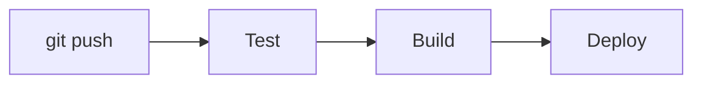

# Day 39: What is CI/CD?

## Task 1: The Problem with Manual Deployments

**1. What can go wrong when 5 developers deploy manually?**
Deploying code directly from a personal laptop can easily override previous code. If Developer A deploys a feature, and Developer B deploys their own local version 5 minutes later, Developer B will wipe out Developer A's changes. There is no central source of truth.

**2. What does "it works on my machine" mean and why is it a real problem?**
This is the classic developer excuse! It means the code runs perfectly on the developer's laptop, but crashes when deployed to the production server. It is a huge problem because a developer's laptop has a completely different environment (different OS, different software versions, different configurations) than the production server. 

**3. How many times a day can a team safely deploy manually?**
Very few—maybe once a day or even once a week. Manual deployments are slow, stressful, and highly prone to human error (like typing the wrong command). If a team tries to manually deploy 10 times a day, they will almost certainly break production.

---

## Task 2: CI vs CD

**1. Continuous Integration (CI)**
Every time a developer pushes code, it is automatically merged ("integrated"), built, and tested by a server. It catches bugs immediately before they reach users.
*Real-world example:* A developer pushes a new feature. A pipeline automatically runs unit tests. If the tests fail, the code is blocked from merging.

**2. Continuous Delivery (CD)**
After CI, the code is automatically packaged and prepared for release (like building a Docker image and sending it to a staging environment). It is 100% ready for production, but a **human** must manually click an "Approve/Deploy" button to release it.
*Real-world example:* A mobile app update is built and tested, but the product manager manually clicks a button to release it to the App Store on Friday morning.

**3. Continuous Deployment (CD)**
Takes Delivery one step further. If the code passes CI, it is automatically deployed straight to production with **zero human intervention**. 
*Real-world example:* Netflix or Amazon pushing minor website updates multiple times a day automatically without anyone clicking a button.

---

## Task 3: Pipeline Anatomy

*   **Trigger:** The event that starts the pipeline (e.g., a developer does a `git push`, or a cron schedule runs at midnight).
*   **Stage:** A high-level logical phase of the pipeline (e.g., the `Build` stage, the `Test` stage, the `Deploy` stage).
*   **Job:** A specific unit of work that runs inside a stage. (e.g., Inside the `Test` stage, you might have two jobs running in parallel: `test-frontend` and `test-backend`).
*   **Step:** A single command or action inside a job (e.g., running `npm install` or `docker build`).
*   **Runner:** The actual server/machine in the cloud that executes your pipeline code. When you use GitHub Actions, GitHub loans you a "Runner" (a virtual machine) for a few minutes to run your jobs.
*   **Artifact:** A file or output produced by a job that you want to save for later (like a compiled `.jar` file, test reports, or a Docker image).

---

## Task 4: Draw a Pipeline

**Scenario:** A developer pushes code to GitHub. The app is tested, built into a Docker image, and deployed to a staging server.

*   **Trigger:** `git push`
*   **Stage 1:** Test (Runs unit tests on the code)
*   **Stage 2:** Build (Builds the code into a Docker Image)
*   **Stage 3:** Deploy (Deploys the Docker image to the staging server)

