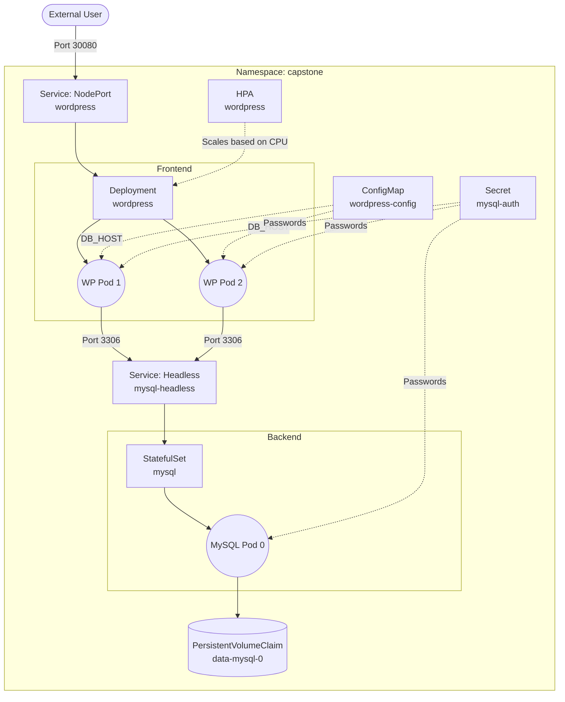

# Day 60 Capstone Project: WordPress + MySQL

This document serves as the step-by-step lab notebook and architecture documentation for the Day 60 Kubernetes Capstone.

---

## 🏗️ Architecture Overview



- **Database Tier:** A `mysql:8.0` container managed by a `StatefulSet`, bound to a `PersistentVolumeClaim` to ensure data persists across crashes. It securely pulls credentials from a `Secret` and is exposed internally via a `Headless Service` to maintain stable DNS (`mysql-0.mysql.capstone.svc.cluster.local`).
- **Frontend Tier:** Two `wordpress:latest` replicas managed by a `Deployment`. They dynamically retrieve the DB connection string from a `ConfigMap` and the passwords from the `Secret`. They use `Liveness` and `Readiness` probes to ensure they don't serve traffic until fully booted.
- **Autoscaling:** A `HorizontalPodAutoscaler` (HPA) monitors the frontend Deployment and scales it up to 10 replicas if CPU utilization exceeds 50%.
- **Networking:** External users access the WordPress frontend through a `NodePort Service` exposed on port `30080`.

---

## 📝 Task Log and Commands

### Task 1: Create the Namespace (Declarative)
We originally created the namespace via the CLI, but to follow professional GitOps standards, we deleted it and created it declaratively using `00-namespace.yaml`.

**Commands Executed:**
```bash
# Apply the declarative namespace
kubectl apply -f 00-namespace.yaml

# Set it as the default namespace for our terminal session
kubectl config set-context --current --namespace=capstone
```

### Task 2: Deploy MySQL

#### Step 2.1: Database Secret
We created a secret using `stringData` to store the database credentials securely without manually base64 encoding them.

**Commands Executed:**
```bash
# Apply all MySQL components
kubectl apply -f 01-mysql-secret.yaml
kubectl apply -f 02-mysql-headless-svc.yaml
kubectl apply -f 03-mysql-statefulset.yaml

# Verify StatefulSet initialization and persistent volume creation
kubectl get pods -w

# Verify the database was created successfully
kubectl exec -it mysql-statefull-set-0 -n capstone -- mysql -u phoenix1 -p'user#capstone' -e "SHOW DATABASES;"
```

**Verification:** Successfully connected to the pod and verified the `capstone-db` was initialized on the Persistent Volume.

### Task 3: Deploy WordPress
**Commands Executed:**
```bash
# Apply the frontend configuration and deployment
kubectl apply -f 04-wordpress-configmap.yaml
kubectl apply -f 05-wordpress-deployment.yaml

# Monitor the WordPress pods as they boot up and run their initialization scripts
kubectl get pods -n capstone -w
```

### Task 4: Expose WordPress
**Commands Executed:**
```bash
# Apply the NodePort Service
kubectl apply -f 06-wordpress-nodeport-svc.yaml

# Verify the service is running
kubectl get svc -n capstone

# Since we are using KIND (Kubernetes in Docker), we use port-forwarding to bypass the Docker network and access it on localhost
kubectl port-forward svc/wordpress 30080:80 -n capstone
```

**Verification:** Access the frontend at `http://localhost:30080` to view the WordPress installation screen!

### Task 5: Test Self-Healing and Persistence
**Commands Executed:**
```bash
# Intentionally delete the MySQL master pod to test resilience
kubectl delete pod mysql-0 -n capstone

# Watch Kubernetes automatically recreate it
kubectl get pods -n capstone -w
```
**Verification:** The `mysql-0` pod was recreated, automatically reattached to the Persistent Volume, and the WordPress site recovered with zero data loss!

### Task 6: Set Up HPA (Horizontal Pod Autoscaling)
**Commands Executed:**
```bash
# Apply the HPA manifest
kubectl apply -f 07-wordpress-hpa.yaml

# FIX: Install the Metrics Server (required for HPA to calculate CPU)
kubectl apply -f https://github.com/kubernetes-sigs/metrics-server/releases/latest/download/components.yaml

# FIX: Patch the Metrics Server to bypass KIND's local TLS certificates
kubectl patch deployment metrics-server -n kube-system --type 'json' -p '[{"op": "add", "path": "/spec/template/spec/containers/0/args/-", "value": "--kubelet-insecure-tls"}]'

# Verify the HPA is successfully calculating CPU utilization
kubectl get hpa
```
**Verification:** HPA is running and successfully registering CPU utilization (e.g., `2%/50%`).

### Task 7: (Bonus) Compare with Helm
**Commands Executed:**
```bash
# Create a test namespace and install the Bitnami WordPress chart
kubectl create namespace helm-test
helm install wp-helm bitnami/wordpress -n helm-test

# Compare the generated resources to our manual capstone namespace
kubectl get all -n helm-test
```
**Verification:** We observed that the Helm chart automatically generated the exact same architecture we built manually (StatefulSet for database, Deployment for frontend, Headless Services, etc.), proving how much time package managers save in production.

### Task 8: Clean Up and Reflect
**Commands Executed:**
```bash
# Nuke the entire test environment
kubectl delete namespace helm-test
kubectl delete namespace capstone
```
**Verification:** All resources were successfully deleted.

---

## 📚 Concepts Learned (Mapping)
| Concept | Day Learned | Application in Capstone |
|---------|-------------|--------------------------|
| **Namespaces** | Day 52 | Isolated the entire application into the `capstone` namespace. |
| **Deployments** | Day 52 | Managed the stateless WordPress frontend replicas. |
| **Services (NodePort)** | Day 53 | Opened port `30080` to access the website from localhost. |
| **Services (Headless)** | Day 53 | Provided stable internal DNS for the MySQL StatefulSet. |
| **ConfigMaps** | Day 54 | Injected the database URL (`WORDPRESS_DB_HOST`) without hardcoding it. |
| **Secrets** | Day 54 | Securely stored and injected `MYSQL_USER` and `MYSQL_PASSWORD`. |
| **Persistent Volumes (PVC)**| Day 55 | Attached a virtual hard drive to MySQL so blog posts survive a crash. |
| **StatefulSets** | Day 56 | Ensured MySQL retains its exact identity (`mysql-0`) and storage when recreating. |
| **Probes** | Day 57 | Checked `/wp-login.php` to know exactly when the frontend was ready for traffic. |
| **Resource Limits** | Day 58 | Capped the CPU/Memory so the pods don't crash the host node. |
| **HPA** | Day 58 | Automatically scaled WordPress if CPU usage exceeded 50%. |
| **Helm** | Day 59 | Proved how package managers can instantly generate this entire stack. |

---

## 🤔 Reflection
- **What was hardest?** Figuring out the hidden traps! Understanding the difference between `envFrom` and `env` secret mapping, and learning that the HPA mathematically requires `resources.requests.cpu` in order to calculate scaling percentages.
- **What clicked?** The power of StatefulSets combined with Headless Services. Intentionally deleting the database pod and watching it come back with the exact same name and all the data perfectly intact was the real "Aha!" moment.
- **What to add for Production?** 
  1. A `LoadBalancer` Service or an `Ingress` controller with SSL/TLS Certificates for HTTPS.
  2. External Secret Managers (like HashiCorp Vault or AWS Secrets Manager) instead of using plain Kubernetes Secrets.
  3. A managed database (like AWS RDS) instead of running a StatefulSet database inside the cluster.
