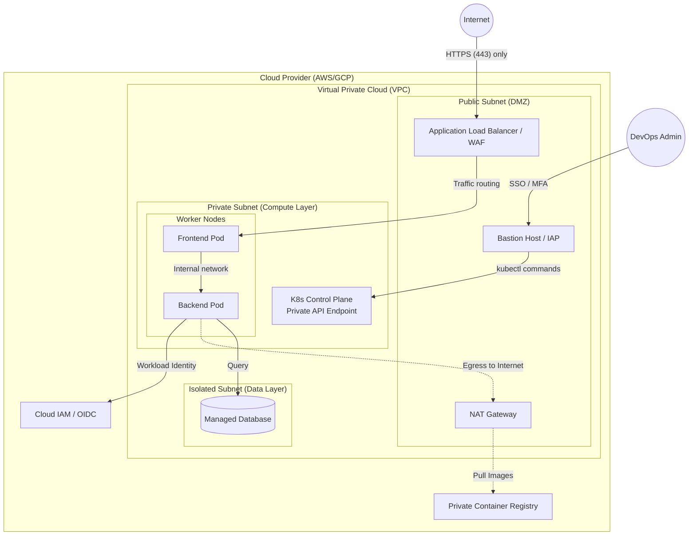

# Architecture 01: The Fort Knox Private Kubernetes Cluster

**Focus:** Network Security, Isolation, and Identity-Based Access.

---

## Overview

In a default cloud deployment, Kubernetes nodes are often assigned Public IP addresses so they can pull images from the internet, and the API server is exposed to `0.0.0.0/0`. This is unacceptable for production environments processing PII or financial data.

The "Fort Knox" architecture completely isolates the compute layer from the internet. All inbound traffic must pass through a strict Application Load Balancer, and all outbound traffic must route through a NAT Gateway. Admin access requires an Identity-Aware Proxy (IAP) or VPN.

---

## 🏗️ Architecture Diagram

---

## 🔑 Key Design Decisions

### 1. No Public IPs on Compute Nodes
The worker nodes live in a **Private Subnet** and have no public routing. It is physically impossible for an external attacker to initiate an SSH or HTTP connection directly to a node. 

### 2. NAT Gateway for Egress
If a pod needs to download a software update, communicate with a third-party API (like Stripe), or pull a container image, that traffic is routed through the NAT Gateway residing in the Public Subnet. The NAT Gateway translates the private IP to a public IP for outbound requests only.

### 3. Identity-Aware Proxy (IAP) / Bastion Host
The Kubernetes API server is private. To run `kubectl` commands, administrators must connect through an IAP (like GCP's Identity-Aware Proxy or AWS Systems Manager Session Manager). This ensures that every `kubectl` session requires corporate SSO, MFA, and is fully logged without needing to expose SSH port 22 or run a vulnerable VPN server.

### 4. Workload Identity (OIDC)
Instead of attaching broad cloud permissions (like S3 read/write) to the underlying EC2/Compute Engine instances, the backend pods authenticate directly with Cloud IAM using **Workload Identity**. If an attacker breaches the frontend pod, they cannot access the cloud storage because the frontend pod lacks the specific IAM identity required.

### 5. Isolated Data Subnets
The managed database (e.g., Cloud SQL or RDS) sits in a dedicated, isolated subnet. It only accepts connections from the specific IP ranges of the Private Compute Subnet.
