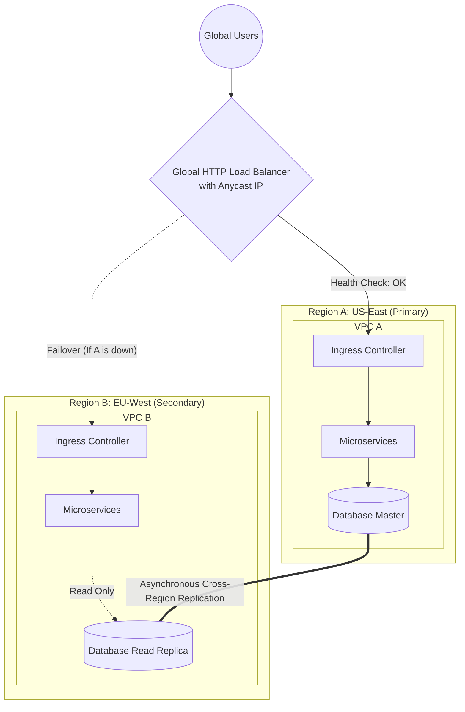

# Architecture 02: Multi-Region High Availability

**Focus:** Disaster Recovery, Redundancy, and Global Traffic Management.

---

## Overview

Even the most robust cloud architectures can fail. Entire cloud regions (like `us-east-1`) have experienced total outages due to cooling failures or routing bugs. 

For mission-critical applications (Tier 1 systems), deploying to a single region is not enough. The Multi-Region High Availability architecture ensures that if a meteorite hits a data center in Virginia, user traffic is instantly rerouted to Europe or the West Coast with zero downtime.

---

## 🏗️ Architecture Diagram

---

## 🔑 Key Design Decisions

### 1. Global Anycast Load Balancing
A Global Load Balancer (like GCP Cloud Load Balancing or AWS Route 53 + CloudFront) provides a single, global IP address. It uses Anycast routing to direct users to the geographic region physically closest to them, drastically reducing latency.

### 2. Active-Passive vs. Active-Active
The diagram above shows an **Active-Passive** (Failover) pattern for the database, but an **Active-Active** pattern for the compute layer.
- **Compute (Active-Active):** Both Region A and Region B handle live traffic simultaneously.
- **Database (Active-Passive):** Region A handles all WRITE operations. Region B receives a continuous asynchronous stream of data. Region B's compute nodes can perform READ operations locally, but must send WRITE operations across the ocean to Region A to prevent data collision.

### 3. Failover Mechanics
The Global Load Balancer continuously polls the `/health` endpoint of the applications in both regions. 
1. If Region A's health checks fail, the Global LB instantly stops routing traffic there. 
2. All global users are redirected to Region B.
3. An automated script or a human operator intervenes to **Promote** Region B's Database Read Replica to become the new Master database so it can start accepting WRITE operations.

### 4. Infrastructure as Code (IaC) is Mandatory
You cannot build this architecture manually by clicking in a cloud console. Terraform is required to stamp out identical infrastructure in both regions. The Terraform code should be completely modular, taking a `region` variable to ensure VPC A and VPC B are perfectly identical.
